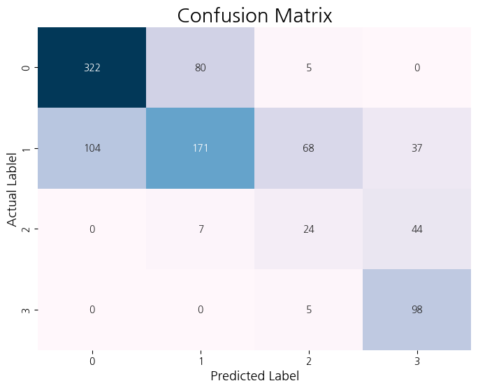

# Skin Aging Classification – Lightweight Models for Mobile Diagnosis

## Project Overview
This project focuses on classifying the level of forehead skin aging into four categories (levels 1 to 4). The goal is to develop a lightweight deep learning model suitable for use in mobile applications, such as smartphone-based skin diagnostics.

Three models were implemented and evaluated for this task: MobileNetV2, SqueezeNet. Each model was fine-tuned and adjusted to improve image classification performance for skin aging analysis.

## Project Files
- **Data** :
  - **image** : 4,825 forehead images from 965 individuals(10~60 ages, man & women), captured at 5 angles (front, left 15°, left 30°, right 15°, right 30°).
  - **label** : 4,825 JSON files containing forehead aging grades and image size details, assessed by experts
  - `json_to_datframe.csv` : A dataframe created from the 4,825 JSON files
- **Notebook** :
  - `json_to_datframe.ipynb` 
  - `training.ipynb`, 'test.ipynb' : model training and test
- **models** : the trained models are saved
- **assets** : Visualisations, such as confusion matrix and real forehead images can be founded.

## Methodology 
- **Constructing Dataframe** : Generate `json_to_datframe.csv` to make json files handling more easy.
- **Preprocessing** :
  Reduced the original 7 labels to 4 categories (0, 1 → 0 / 2, 3 → 1 / 4 → 2 / 5, 6 → 3) to minimize confusion in the confusion matrix and provide consumers with more intuitive aging level interpretations.
Images were cropped based on bounding box coordinates. Applied data augmentation techniques including horizontal flip, vertical flip, and rotation.
  
- **Modeling** : **MobileNetV2*** and **SqueezeNet**(lighter models) were used, and each model underwent processes such as dropout, adjusting the number of nodes, and modifying the batch size to prevent overfitting and improve model performance.
- **Evaluation** : Assess models using accuracy and confusion matrices on the test set.

  ***MobileNetV2 Test Result***
  
  

## Key Findings 
- **Model Performance**

  ***Model comparison using the image test set***
  
  | **Model**                          | **Test Accuracy** | **Model Size** | **Time** |
  |------------------------------------|-------------------|----------------|----------|
  | MobileNetV2                        | 0.63              |                |          |
  | MobileNetV2 (+ Augmentation)       | 0.59              |                |          |
  | SqueezeNet                         | 0.42              |                |          |

## Conclusion
- User end : Personalized solution, Time- and cost-efficient skin diagnosis
- Business end : Lightweight model enables fast skin diagnosis for consumers,
Facilitates targeted marketing strategies,
Enables efficient R&D — reducing development costs and focusing on high-demand products

## Used Datasets
- **Skin Images Datasets** : [Korean Skin Condition Measurement Data](https://www.aihub.or.kr/aihubdata/data/view.do?currMenu=&topMenu=&aihubDataSe=data&dataSetSn=71645)
